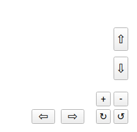

# 3DViewer

## https://github.com/InAnotherLife/3DViewer

## Стек: С, Qt
## 1. Описание
Программа разработана на языке С стандарта C11. Графический интерфейс создан при помощи фреймворка Qt версии 6.2.  
Код программы находится в папке src. Сборка программы осуществляется с помощью Makefile (цели all, install, uninstall, dist, tests, gcov_report, clean).  
Обеспечено покрытие кода unit-тестами с помощью библиотеки Check.

## 2. Особенности программы

Чтобы загрузить модель, нужно нажать кнопку "Открыть файл".  
После загрузки доступно быстрое перемещение по осям "X", "Y", вращение по осям "X", "Y" и масштабирование модели при помощи кнопок:

В верхней части программы находятся настройки типа проекции, фона, ребер и вершин.  
Настройки программы сохраняются между перезапусками. Чтобы сбросить текущие настройки, нужно нажать на кнопку "Сбросить настройки".
